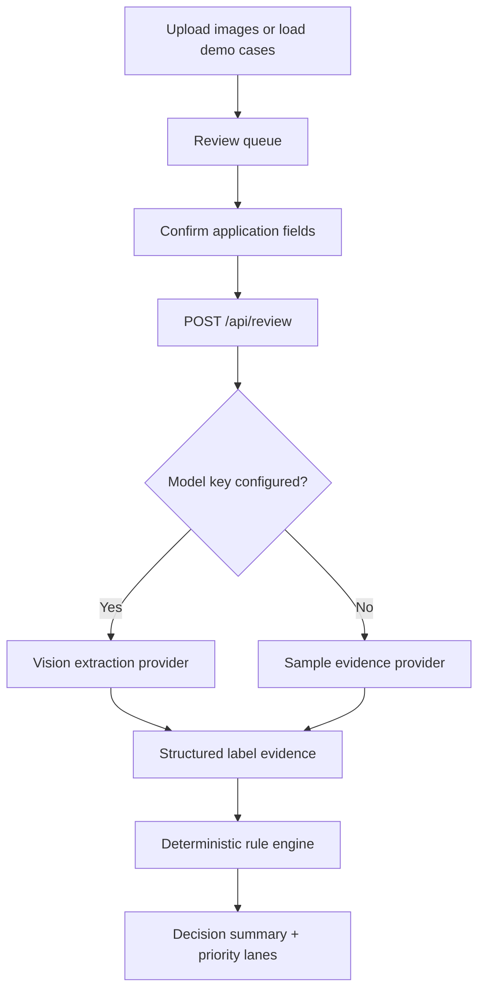

# Design Brief

## Product Angle

The assignment notes point to speed, trust, batch handling, and a simple UI for reviewers with mixed technical comfort. This prototype focuses on a **guided evidence packet**: a reviewer selects label packets, confirms expected application data, runs checks, and reviews clear next actions.

## Architecture

## Key Decisions

| Decision | Reason |
| --- | --- |
| Stepper workflow | The work has a natural sequence; first-time users should know where to start. |
| Empty first screen | Avoids showing results before the user loads a queue. |
| Demo cases as evaluation mode | Reviewers can test clear, fuzzy, warning, and incomplete outcomes without production records. |
| AI as evidence reader | Model/OCR output is useful but should not own the compliance decision. |
| Deterministic rules | Warning text, ABV/proof, volume, and field matching need explainable behavior. |
| Batch queue + CSV export | Shows the peak-season workflow without adding persistence or background workers. |

## Current Scope

- Multi-image upload and batch verification queue.
- Editable application fields.
- Field-level findings with expected value, label evidence, confidence, and next action.
- Strict warning prefix/text check.
- Numeric alcohol and volume checks.
- Tolerant text checks for names/classes/addresses.
- Offline sample mode plus optional model extraction.

## Trade-Offs

- No COLA integration, identity, database, or retention workflow.
- Demo mode maps known test filenames to sample evidence; a configured model key is needed for real image extraction.
- Warning boldness, font size, placement, and prominence remain manual visual checks.
- PDF conversion and large-scale asynchronous batch processing are outside version 1.

